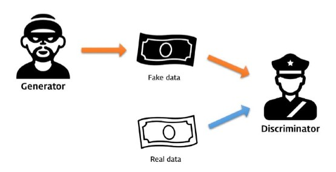
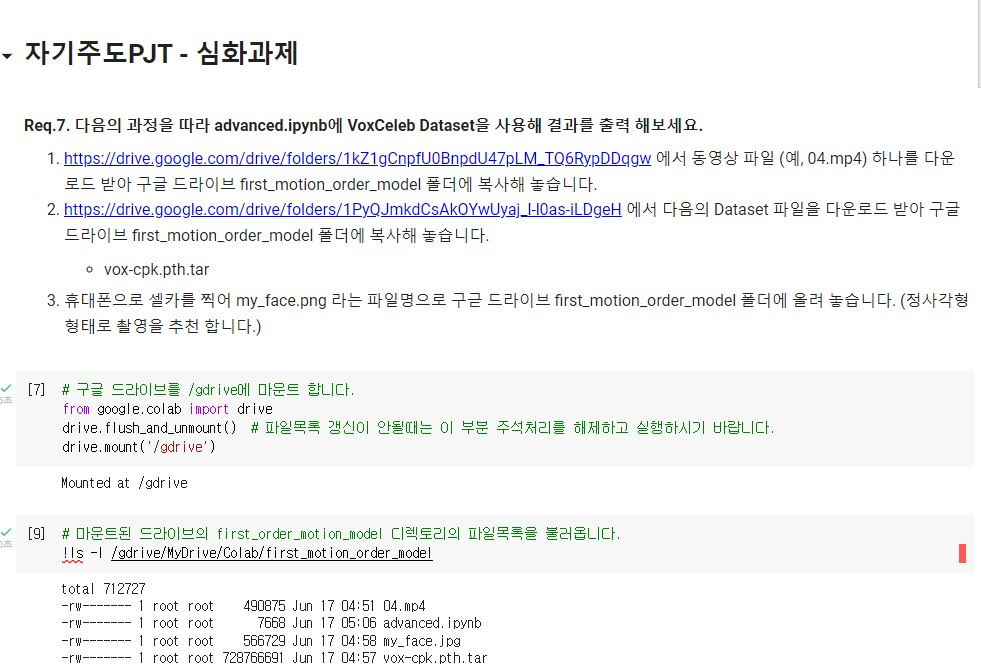
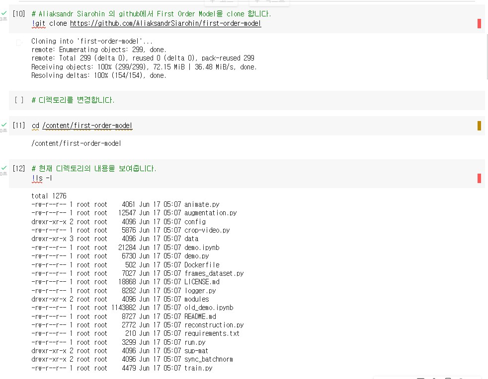
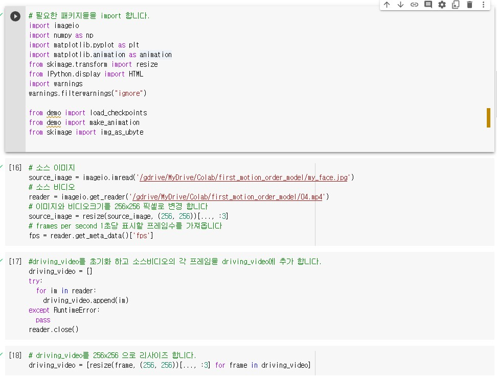
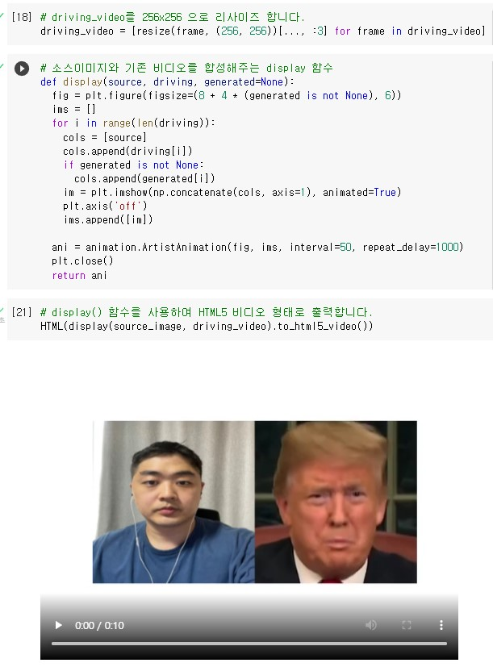
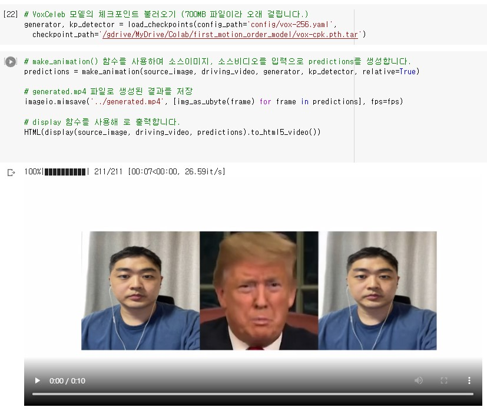
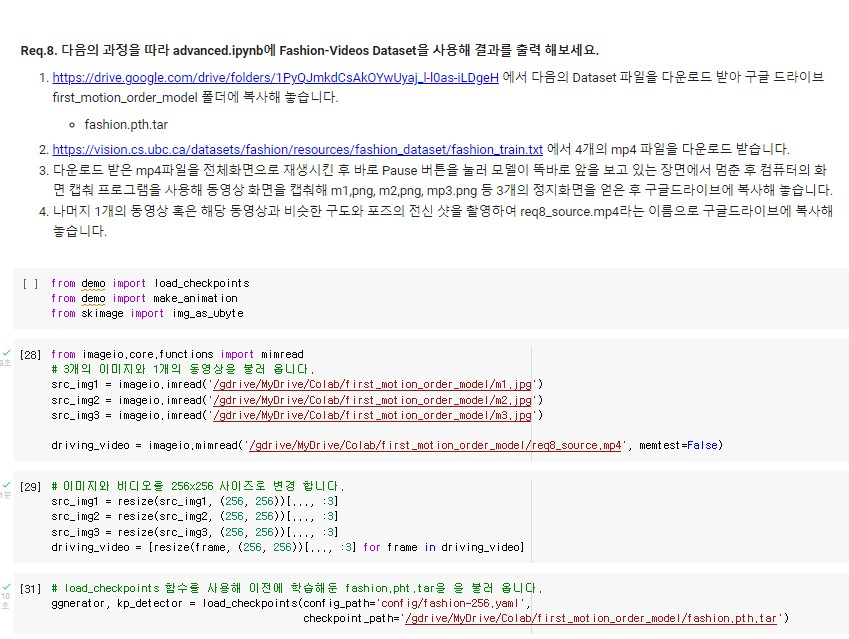
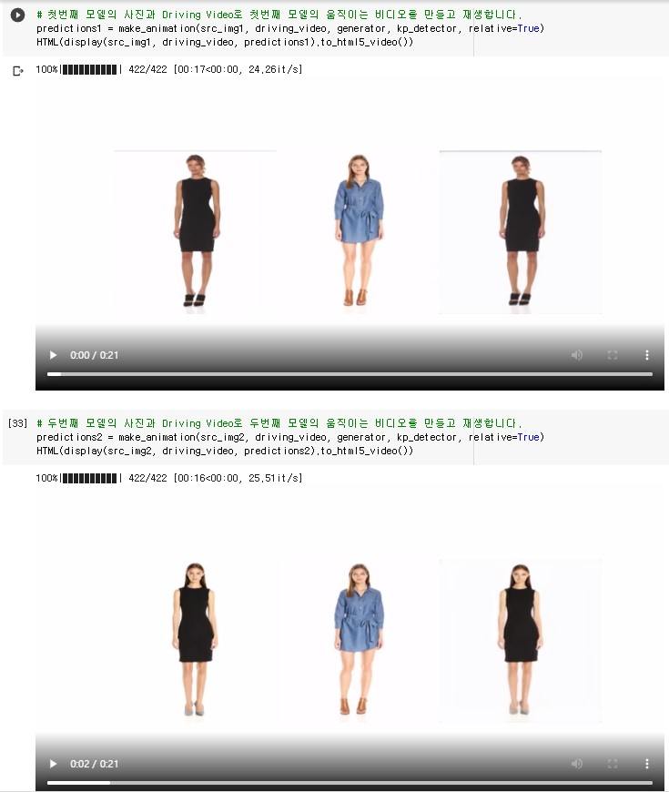
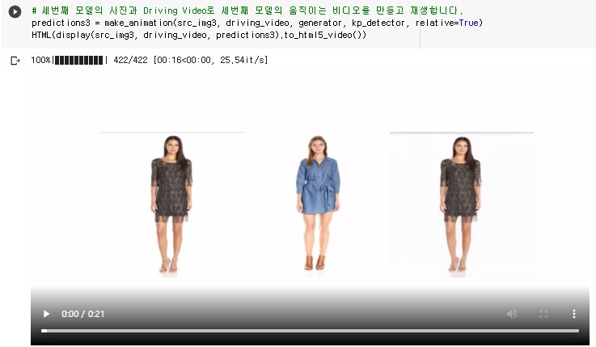

# 🎉 Google Colab 기반의 Genrative Adversarial Network 응용

   머신러닝 분야에서 나온 Genrative Adversarial Network(생성적 적대 신경망, GAN)은 간단히 말하자면 적대적인 관계에 있는 2개의 모델들이 상호간의 Output을 기반으로 학습을 하여 정확도를 높여가는 개념


## 기본개념

  위조지폐를 계속해서 만드는 위조지폐범과 주어진 지폐가 위조지폐인지 아닌지를 판별하는 수사관이 있다고 가정할 때 다음과 같은 형태로 학습을 진행.



1. 위조지폐범은 본인이 만든 위조지폐를 수사관에서 제공해서 피드백을 받으면서 학습을 하여 위조지폐를 보다 정교하게 만듬.
2.  수사관은 위조지폐와 지폐를 가지고 위조지폐 여부를 판단하고 피드백을 받아 학습과정을 거쳐 위조지폐를 판단하는 능력을 보다 정교하게 만듬

  여기까지 수행을 하면 1 epoch라고 한다. 이를 계속 반복해 실행하게 되면 각각의 역할을 가진 2개의 모델은 계속해서 정교해지게 되고 Generator가 생성한 위조지폐를 Discriminator(판별자)가 진짜인지 아닌지 구분하지 못하고 정답 확률이 50%가 되는 순간 학습이 끝남.


## 필수지식학습

```
# Java 개발자를 위한 Python간단정리
https://haloper.tistory.com/32

# Colab
https://colab.research.google.com/
```


## Colab

Jupyter Notebook에 추가로 Python소스코드를 Google의 클라우드 컴퓨팅 환경에서 GPU와 TPU를 무료로 사용할 수 있고 소스코드나 데이터를 Google Drive를 통해 불러오거나 저장할 수도 있는 개발 환경.

Cloud 기반이므로 별도의 설치과정이 필요 없으며 딥러닝, M/L, 데이터 사이언스 분야에서 사용됨.


## 결과
















