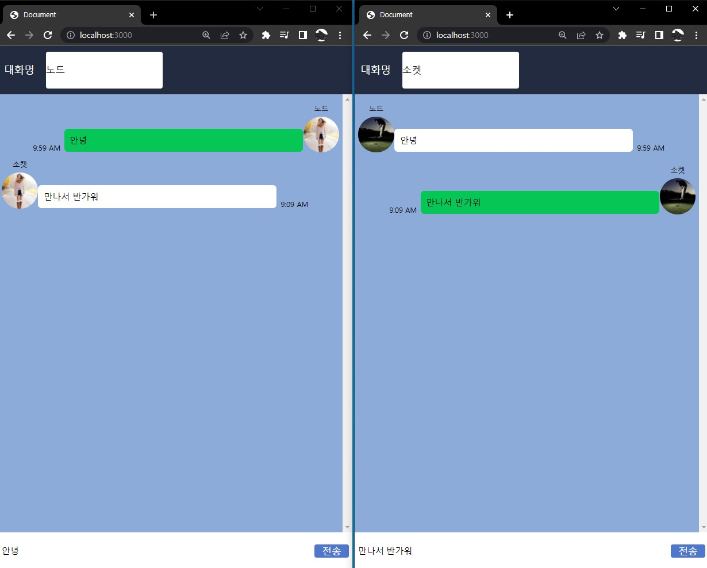

# 🎉 Node.js와 Socket.io를 이용한 채팅구현

  node.js 웹소켓 라이브러리 socket.io를 활용하여 간단한 채팅서버를 구현해보자. 

웹기반 채팅서버를 구현해보고 설치형 메신저와 웹메신저의 차이를 이해해보자.


## 필수지식학습

`Node.js` : https://nodejs.org/ko/about/

`Express` : https://expressjs.com/ko/

`Socket.io` : https://socket.io.docs/v4/


## 기능목록

- 환경구축
- 채팅 서버 구현
- 클라이언트 구현
- 서버 실행 및 채팅 기능 확인


## install

```vue
# package.json 생성 및 초기화
npm init -y

# express 라이브러리 설치
npm install express

# moment 라이브러리 설치(시간설정)
npm install moment

# nodejs를 실시간 감지
npm install -g nodemon
```


## 결과




## ++

- 채팅을 쳤을 때 전에 쳤던 내용이 남아있는 부분 수정필요
- moment를 사용하였을 때 시간이 제대로 뜨지 않는 부분 수정필요
