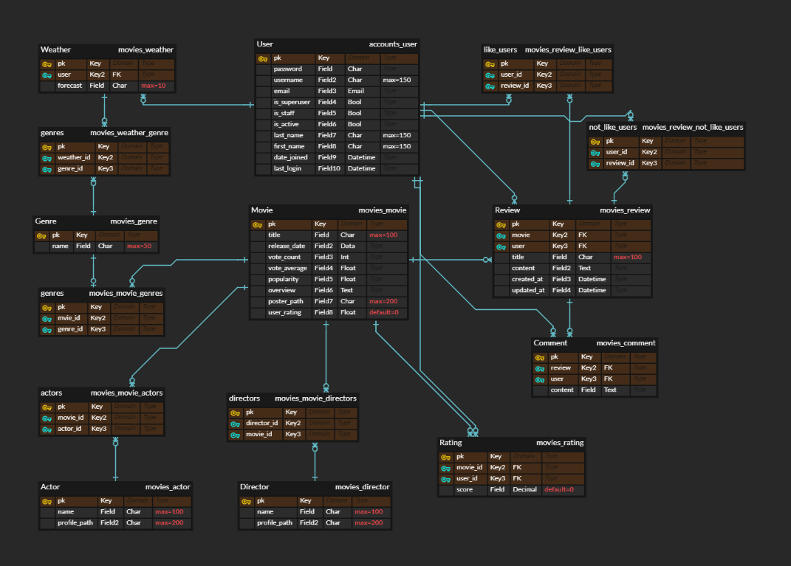
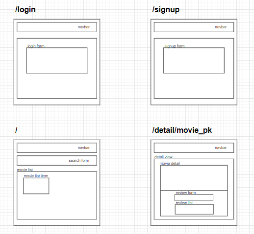
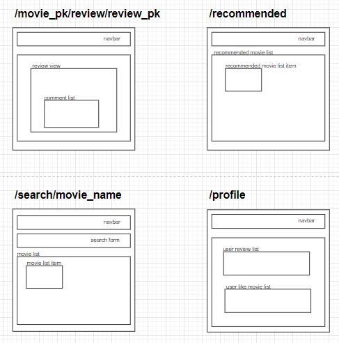

## **시작하기**

1. django

   - 가상환경 구축

     ```bash
     $ python -m venv venv
     
     $ source venv/Scripts/activate
     ```

   - 패키지 설치

     ```bash
     $ pip install -r requirements.txt
     ```

   - migrate 후 데이터 로드

     ```bash
     $ python manage.py migrate
     
     $ python manage.py loaddata movies/movies.json movies/actors.json movies/directors.json movies/genres.json
     ```

   - 서버 실행

     ```bash
     $ python manage.py runserver
     ```

     

2.  vue

   - 패키지 설치 후 서버 실행

     ```bash
     $ npm install
     
     $ npm run serve
     ```

     


## **1. 팀원 정보 및 업무 분담 내역**

| 팀원   | 업무 내용                                                    |
| ------ | ------------------------------------------------------------ |
| 장종훈 | Front-end : 메인, 추천, 검색 페이지 구현, CSS 및 Bootstrap   |
| 배건길 | Front-end : 디테일 페이지 구현(리뷰, 댓글, 평점), CSS 및 Bootstrap |
| 조유진 | Back-end : Django 모델링, 데이터 수집(TMDB API), 추천 알고리즘 |


## **2. 목표 서비스 구현 및 실제 구현 정도**

| 목표                                                         | 실제 구현                                                    |
| ------------------------------------------------------------ | ------------------------------------------------------------ |
| Accounts<br /><br />관리자 페이지 (영화, 유저 관리) <br />유저 로그인, 로그아웃 <br />유저 회원가입, 회원탈퇴 <br />소셜 로그인 | Accounts<br /><br />관리자 페이지 (영화, 유저 관리) <br />유저 로그인, 로그아웃 <br />유저 회원가입, 회원탈퇴 <br /> |
| DB & API <br /><br />영화 데이터 크롤링(TMDB API) <br />데이터 모델링 영화 예고편 (Youtube API) <br />영화에 대한 유저 평점 <br />유저 평점 기반 추천 알고리즘 | DB & API <br /><br />영화 데이터 크롤링(TMDB API) <br />데이터 모델링 영화 예고편 (Youtube API) <br />영화에 대한 유저 평점 <br />유저 평점 기반 추천 알고리즘 |
| Community <br /><br />영화 리뷰 작성, 수정, 삭제 <br />리뷰 댓글 작성, 수정, 삭제 <br />리뷰 좋아요, 싫어요 기능 | Community <br /><br />영화 리뷰 작성, 수정, 삭제 <br />리뷰 댓글 작성, 수정, 삭제 <br />리뷰 좋아요, 싫어요 기능 |
| Web <br /><br />메인 페이지에 영화 리스트 <br />영화 클릭시 디테일 페이지로 이동 <br />영화 제목, 배우, 감독으로 검색 기능 <br />영화 추천 페이지 <br />유저 프로필 페이지 | Web <br /><br />메인 페이지에 영화 리스트 <br />영화 클릭시 디테일 페이지로 이동 <br />영화 제목으로 검색 기능 <br />영화 추천 페이지 <br />유저 프로필 페이지 |


## **3. 데이터베이스 모델링 (ERD) & 컴포넌트 구성**

### 3-1. ERD




### 3-2. Components






## **4. 필수 기능에 대한 설명**

### 4-1. 영화 목록

- `popularity` 순으로 정렬한 전체 영화를 페이지에 렌더링

- 페이지 아래 버튼을 생성해 한 번에 렌더링 되는 영화의 수를 조절

- 각각의 영화를 클릭 시 영화의 상세 페이지로 이동

  - 영화에 대한 좋아요와 평점

  

### 4-2. 추천

- 유저가 좋아요한 영화가 존재할 경우 해당 영화들의 장르를 기반으로 추천

  - 유저가 좋아요한 영화의 장르들 중 가장 빈도수가 높은 장르를 채택해서 추천

- 유저가 좋아요한 영화가 존재하지 않을 경우 오늘 날씨 기반 추천

  - [기상청 API](https://www.data.go.kr/data/15084084/openapi.do)를 활용하여 유저의 날씨 정보를 파악하고 날씨를 6가지로 분류
  - 분류한 날씨에 따른 장르를 설정해두고 해당 장르 기반 추천

  

### 4-3. 커뮤니티

- 영화의 상세 페이지에서 해당 영화에 대한 리뷰 작성, 수정, 삭제 가능

- 리뷰 클릭 시 리뷰의 상세 페이지로 이동

  - 리뷰에 대한 좋아요와 싫어요 표시
  - 리뷰에 대한 댓글 작성, 수정, 삭제

  

### 4-4. 검색

- 메인 페이지에서 검색 시 해당 단어가 포함된 영화 출력
- 검색 페이지에서 영화 클릭 시 해당 영화의 상세 페이지로 이동


### 4-5. 프로필

- 유저의 프로필 페이지에서 유저가 작성한 리뷰와 좋아요한 영화 조회 가능
- 회원 탈퇴 버튼 클릭 시 회원 탈퇴\

 

##  **5. 기타 (느낀 점)**


- 장종훈: 팀프로젝트를 진행하면서 사전조사가 매우 중요하다는 것을 배웠습니다. 처음엔 영화관처럼 영화예고편을 자동재생해서 보여주고 싶었으나 크롬정책에 의해 자동재생과 반복재생이 동작하지 않아 많은시간을 낭비하게 되었습니다. 좀 더 철저하게 준비하고 시작했으면 더 좋은 결과물이 나왔을거같아 아쉽지만 팀원들과 서로 도우면서 문제를 하나하나 해결할 때마다 짜릿함을 느끼며 서로 즐겁고 재밌게 프로젝트 했던거 같습니다. 팀장으로써 프로젝트를 제대로 이끌지 못했지만 다음엔 다양한 기능들을 구현할수 있도록 하고싶습니다.


- 배건길 : 팀프로젝트 경험을 통해서 git branch사용부터 merge까지 하나까지 소통을 해야된다는 것을 알았습니다. 처음에는 기획한대로 웹사이트를 만들 수 있을까 막막했지만 프로젝트 기간동안 조원들과 고생해보니 결과물이 나오기는 하는구나 생각이 들었습니다.


- 조유진: 프로젝트를 시작할 때는 여러 기능들을 넣어보고 싶었지만 막상 진행하다보니 시간이 부족함을 느꼈습니다. 부족한 시간에도 기본 기능들을 다 구현했다는 것이 다행이라는 생각이 들었습니다. 다음에는 과제에 따른 시간 배분을 더 잘해서 다양한 기능들을 구현해보고 싶습니다.
